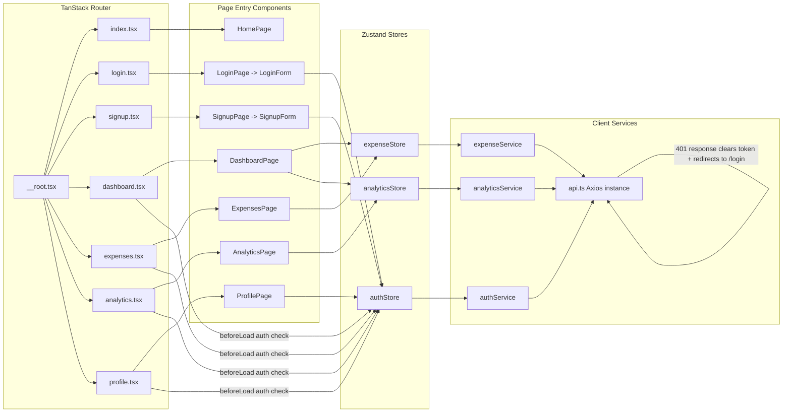
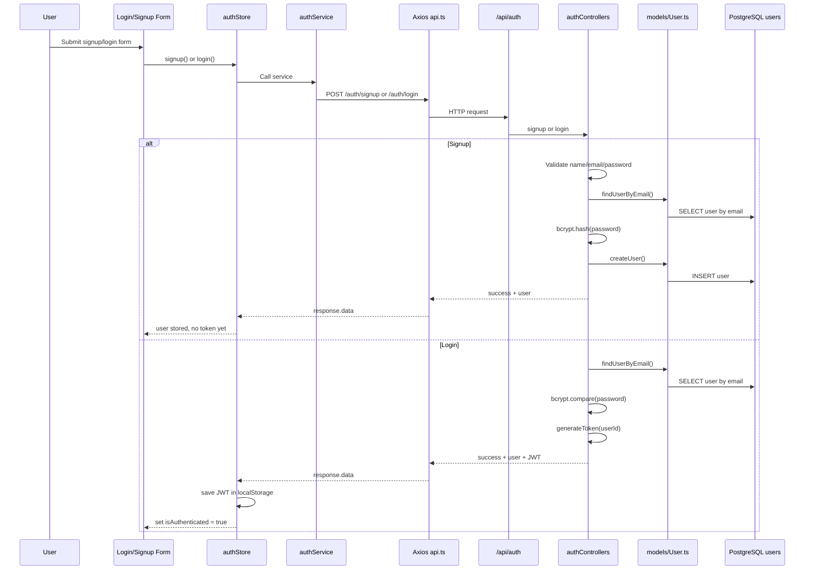
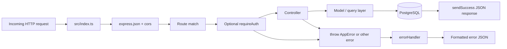
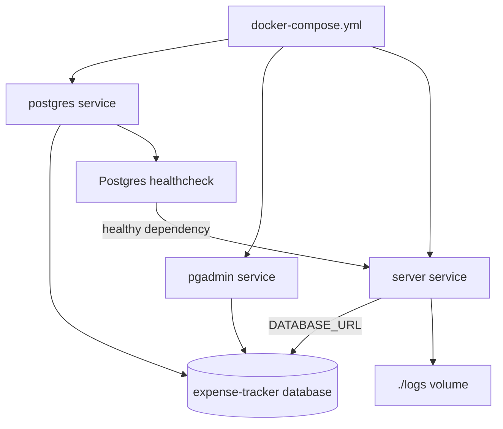

# PennyWise Project Flow Chart

This document reflects the current codebase in `client/` and `server/`, including the PostgreSQL + Prisma backend, protected routing, Zustand stores, analytics queries, and Docker runtime.

## 1. End-to-End System Flow

```mermaid
flowchart TD
    U[User] --> B[Browser / React 19 Client]

    subgraph Client["Client App (Vite + React + TanStack Router + Zustand)"]
        M[main.tsx]
        A[App.tsx]
        RT[routeTree.gen.ts]
        ROOT[__root.tsx RootLayout]
        NAV[Navigation]

        ROUTES[Routes]
        HOME[/index route -> HomePage/]
        LOGIN[/login route -> LoginPage/]
        SIGNUP[/signup route -> SignupPage/]
        DASH[/dashboard route -> DashboardPage/]
        EXP[/expenses route -> ExpensesPage/]
        ANA[/analytics route -> AnalyticsPage/]
        PRO[/profile route -> ProfilePage/]

        GUARD[beforeLoad route guards]
        AUTHSTORE[authStore]
        EXPSTORE[expenseStore]
        ANASTORE[analyticsStore]

        APICLIENT[Axios api.ts]
        TOKEN[localStorage TOKEN_KEY]
    end

    subgraph Server["Server App (Express 5 + TypeScript)"]
        SIDX[src/index.ts]
        CORS[CORS + express.json]
        ROUTER[Mounted API Routers]
        AUTHMW[requireAuth middleware]
        ERRORMW[errorHandler]

        AUTHR[/api/auth]
        EXPR[/api/expenses]
        PROR[/api/profile]
        ANAR[/api/analytics]
    end

    subgraph Data["Data Layer"]
        DBINIT[connectDB]
        PGPOOL[pg Pool]
        PRISMA[Prisma Client]
        USERS[(users table)]
        EXPENSES[(expenses table)]
    end

    subgraph Infra["Runtime / Containers"]
        CLIENTDEV[Vite dev server :3000]
        SERVERCTR[Node server :8000]
        POSTGRES[Postgres 15]
        PGADMIN[pgAdmin :8080]
        DOCKER[docker-compose.yml]
    end

    U --> CLIENTDEV
    CLIENTDEV --> M --> A --> RT --> ROOT
    ROOT --> NAV
    ROOT --> ROUTES
    ROUTES --> HOME
    ROUTES --> LOGIN
    ROUTES --> SIGNUP
    ROUTES --> DASH
    ROUTES --> EXP
    ROUTES --> ANA
    ROUTES --> PRO

    DASH --> GUARD
    EXP --> GUARD
    ANA --> GUARD
    PRO --> GUARD
    GUARD --> AUTHSTORE
    AUTHSTORE --> TOKEN

    LOGIN --> AUTHSTORE
    SIGNUP --> AUTHSTORE
    DASH --> EXPSTORE
    DASH --> ANASTORE
    EXP --> EXPSTORE
    ANA --> ANASTORE
    PRO --> AUTHSTORE

    AUTHSTORE --> APICLIENT
    EXPSTORE --> APICLIENT
    ANASTORE --> APICLIENT
    TOKEN --> APICLIENT

    APICLIENT -->|Authorization Bearer token| SIDX
    SIDX --> CORS --> ROUTER
    ROUTER --> AUTHR
    ROUTER --> EXPR
    ROUTER --> PROR
    ROUTER --> ANAR

    EXPR --> AUTHMW
    PROR --> AUTHMW
    ANAR --> AUTHMW

    AUTHR --> PRISMA
    EXPR --> PRISMA
    PROR --> PRISMA
    ANAR --> PGPOOL

    SIDX --> ERRORMW
    AUTHMW --> ERRORMW

    DBINIT --> PGPOOL
    DBINIT --> PRISMA
    PRISMA --> USERS
    PRISMA --> EXPENSES
    PGPOOL --> USERS
    PGPOOL --> EXPENSES

    DOCKER --> POSTGRES
    DOCKER --> PGADMIN
    DOCKER --> SERVERCTR
    SERVERCTR --> POSTGRES
```

## 2. Client Navigation and State Flow



## 3. Authentication Flow



## 4. Expense CRUD Flow

```mermaid
flowchart TD
    U[User on Dashboard or Expenses page]
    MODAL[ExpenseModal / ExpenseForm]
    STORE[expenseStore]
    SVC[expenseService]
    API[Axios api.ts]
    ROUTE[/api/expenses routes]
    AUTH[requireAuth]
    CTRL[expenseControllers]
    USERMODEL[findUserById]
    EXPMODEL[Expense model functions]
    DB[(expenses table)]

    U -->|Create / Edit / Delete / Filter| MODAL
    MODAL --> STORE
    STORE -->|createExpense|getC[createExpenseService]
    STORE -->|getAllExpenses|getR[getAllExpensesService]
    STORE -->|updateExpense|getU[updateExpenseService]
    STORE -->|deleteExpense|getD[deleteExpenseService]

    getC --> SVC
    getR --> SVC
    getU --> SVC
    getD --> SVC
    SVC --> API --> ROUTE --> AUTH --> CTRL

    CTRL --> USERMODEL
    CTRL --> EXPMODEL
    USERMODEL --> DB
    EXPMODEL --> DB

    CTRL --> VALIDATE[Validate amount/category/description/date + ownership]
    VALIDATE --> RESPONSE[sendSuccess response]
    RESPONSE --> STORE
    STORE --> UI[Expenses list / dashboard recent expenses / counts]
```

## 5. Analytics Flow

```mermaid
flowchart TD
    AP[AnalyticsPage]
    DP[DashboardPage]
    ASTORE[analyticsStore]
    ES[expenseStore]
    ASVC[analyticsService]
    API[Axios api.ts]
    AR[/api/analytics]
    AUTH[requireAuth]
    ACTRL[analyticsControllers]
    ENSURE[ensureUser]
    SQL[Raw SQL via pg query()]
    DB[(expenses table)]

    DP -->|after expenses exist| ASTORE
    AP -->|initial loadAllAnalytics()| ASTORE
    AP -->|selectedYear change| ASTORE
    ES -->|expense length used to trigger analytics fetches| DP

    ASTORE -->|getDashboardStats| ASVC
    ASTORE -->|getCategoryStats| ASVC
    ASTORE -->|getTrends| ASVC
    ASTORE -->|getPeriodStats(days)| ASVC
    ASTORE -->|getYearlyStats(year)| ASVC
    ASTORE -->|getCurrentMonth| ASVC
    ASTORE -->|getYearlyCategoryStats(year)| ASVC
    ASTORE -->|getAllYears| ASVC

    ASVC --> API --> AR --> AUTH --> ACTRL --> ENSURE --> SQL --> DB

    SQL --> CAT[Category totals and percentages]
    SQL --> DASHSTATS[Total, count, avg, current month, last month]
    SQL --> TRENDS[Last 6 month trends]
    SQL --> PERIOD[Custom day-range category totals]
    SQL --> MONTHLY[Monthly totals by year]
    SQL --> CURRENT[Current month category totals]
    SQL --> YEARCAT[Monthly category breakdown for year]
    SQL --> ALLYEARS[Totals grouped by year]

    CAT --> ASTORE
    DASHSTATS --> ASTORE
    TRENDS --> ASTORE
    PERIOD --> ASTORE
    MONTHLY --> ASTORE
    CURRENT --> ASTORE
    YEARCAT --> ASTORE
    ALLYEARS --> ASTORE

    ASTORE --> CHARTS[Recharts visual components]
    CHARTS --> OUT[Dashboard cards, pie chart, line chart, yearly charts, tables, lazy year sections]
```

## 6. Profile Flow

```mermaid
flowchart TD
    U[User on ProfilePage]
    PROFILEUI[ProfileView / ProfileEditForm / ExportDataButton / DeleteAccountModal]
    AUTHSTORE[authStore]
    AUTHSVC[authService]
    API[Axios api.ts]
    PR[/api/profile routes]
    AUTH[requireAuth]
    PCTRL[profileControllers]
    UMODEL[User model]
    EXMODEL[Expense model]
    DB[(users + expenses tables)]

    U --> PROFILEUI --> AUTHSTORE --> AUTHSVC --> API --> PR --> AUTH

    PR -->|GET /| PCTRL
    PR -->|PUT /| PCTRL
    PR -->|GET /export| PCTRL
    PR -->|DELETE /account| PCTRL

    PCTRL --> UMODEL --> DB
    PCTRL --> EXMODEL --> DB

    PCTRL --> ACTIONS[Validate input, hash password, export JSON payload, delete expenses, delete user]
    ACTIONS --> AUTHSTORE
    AUTHSTORE --> UI[Profile screen refresh or logout/reset]
```

## 7. Backend Request Lifecycle



## 8. Data Model Flow

```mermaid
erDiagram
    USERS ||--o{ EXPENSES : owns

    USERS {
        int id PK
        string name
        string email UNIQUE
        string password
        timestamptz created_at
        timestamptz updated_at
    }

    EXPENSES {
        int id PK
        int user_id FK
        decimal amount
        string category
        string description
        timestamptz date
        timestamptz created_at
        timestamptz updated_at
    }
```

## 9. Docker Runtime Flow



## 10. Important Notes from Current Code

- The current backend is PostgreSQL-based with `pg` + `Prisma`, even though the root `README.md` still describes an older MongoDB/Mongoose architecture.
- `authStore` initializes `token` from `localStorage`, but protected route guards currently check `isAuthenticated`, which starts as `false` until login happens again in the current session.
- Expense filtering in the UI includes search/date/amount state on the client store, but only `category` and `sort` are sent to the backend API right now.
- Analytics uses raw SQL through `pg` instead of Prisma so aggregate queries can be handled directly in PostgreSQL.
